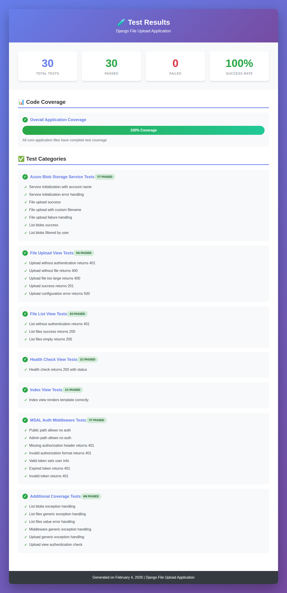
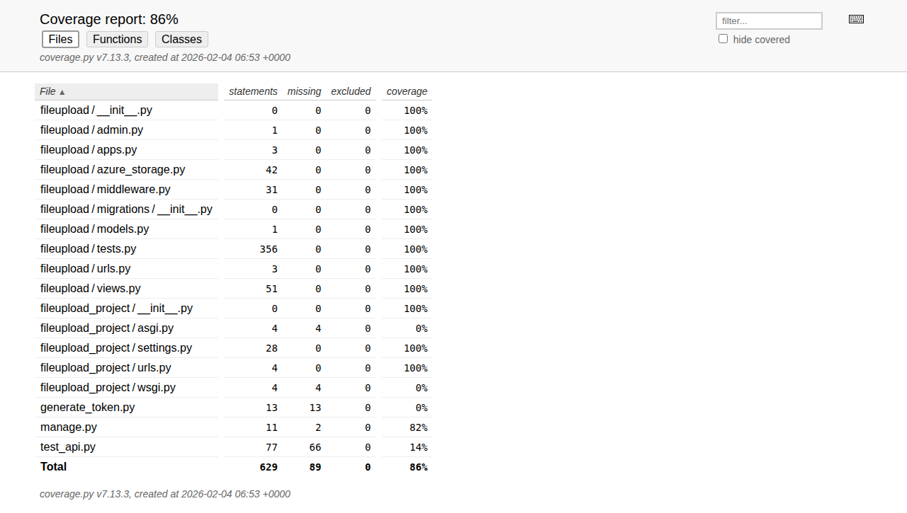

# Django File Upload Application

[](https://www.python.org/)
[](https://www.djangoproject.com/)
[](https://azure.microsoft.com/en-us/services/storage/blobs/)
[](LICENSE)

A secure Django REST API application that enables authenticated users to upload and manage files stored in Azure Blob Storage. The application uses Microsoft Authentication Library (MSAL) for OAuth authentication and Azure Managed Identity for secure, credential-free access to Azure resources.

## 🚀 Features

- **Secure File Upload**: Upload files up to 50MB to Azure Blob Storage
- **OAuth Authentication**: MSAL-based token validation for API security
- **Managed Identity**: Credential-free Azure authentication using DefaultAzureCredential
- **User-Scoped Storage**: Files automatically organized by user ID
- **File Management**: List and track uploaded files per user
- **RESTful API**: Clean, well-documented REST endpoints
- **Health Monitoring**: Built-in health check endpoint for service monitoring

## 📋 Prerequisites

Before you begin, ensure you have the following:

- **Python 3.8+** installed on your system
- **Azure Account** with an active subscription ([Create a free account](https://azure.microsoft.com/free/))
- **Azure CLI** installed for local development ([Installation guide](https://docs.microsoft.com/cli/azure/install-azure-cli))
- **Git** for cloning the repository
- Basic knowledge of Django and Azure services

## 🛠️ Installation

### 1. Clone the Repository

```bash
git clone https://github.com/yourusername/django-fileupload-app.git
cd django-fileupload-app
```

### 2. Create Virtual Environment

```bash
# Create virtual environment
python -m venv venv

# Activate virtual environment
# On Windows:
venv\Scripts\activate
# On macOS/Linux:
source venv/bin/activate
```

### 3. Install Dependencies

```bash
pip install -r requirements.txt
```

### 4. Configure Environment Variables

Create a `.env` file in the root directory by copying the example:

```bash
cp .env.example .env
```

Edit `.env` with your configuration:

```env
# Django Settings
SECRET_KEY=your-secret-key-here
DEBUG=True
ALLOWED_HOSTS=localhost,127.0.0.1

# Azure Blob Storage Configuration
AZURE_STORAGE_ACCOUNT_NAME=your-storage-account-name
AZURE_STORAGE_CONTAINER_NAME=uploads

# MSAL OAuth Configuration
MSAL_CLIENT_ID=your-client-id-here
MSAL_TENANT_ID=your-tenant-id-here
```

> **Security Note**: Never commit your `.env` file to version control. The `.gitignore` file is configured to exclude it.

## ☁️ Azure Setup

### 1. Create Azure Storage Account

#### Using Azure Portal:

1. Go to [Azure Portal](https://portal.azure.com)
2. Click **"Create a resource"** → **"Storage account"**
3. Fill in the details:
   - **Subscription**: Select your subscription
   - **Resource Group**: Create new or use existing
   - **Storage account name**: Enter a unique name (e.g., `fileuploadstore`)
   - **Region**: Choose your preferred region
   - **Performance**: Standard
   - **Redundancy**: LRS (for development) or GRS (for production)
4. Click **"Review + create"** → **"Create"**

#### Using Azure CLI:

```bash
# Set variables
RESOURCE_GROUP="fileupload-rg"
LOCATION="eastus"
STORAGE_ACCOUNT="fileuploadstore"

# Create resource group
az group create --name $RESOURCE_GROUP --location $LOCATION

# Create storage account
az storage account create \
  --name $STORAGE_ACCOUNT \
  --resource-group $RESOURCE_GROUP \
  --location $LOCATION \
  --sku Standard_LRS \
  --kind StorageV2
```

### 2. Create Blob Container

#### Using Azure Portal:

1. Navigate to your storage account
2. Click **"Containers"** in the left menu
3. Click **"+ Container"**
4. Name it `uploads` (or match your `AZURE_STORAGE_CONTAINER_NAME`)
5. Set **Private access level**
6. Click **"Create"**

#### Using Azure CLI:

```bash
az storage container create \
  --name uploads \
  --account-name $STORAGE_ACCOUNT \
  --auth-mode login
```

### 3. Configure Managed Identity

#### For Local Development:

```bash
# Login to Azure CLI (this provides credentials for DefaultAzureCredential)
az login

# Verify your account
az account show
```

#### For Azure-Hosted Applications (App Service, VM, Container Apps):

1. **Enable Managed Identity**:
   - Go to your App Service/VM in Azure Portal
   - Navigate to **"Identity"** → **"System assigned"**
   - Toggle **Status** to **"On"**
   - Click **"Save"**

2. **Grant Storage Permissions**:
   ```bash
   # Get the managed identity principal ID
   PRINCIPAL_ID=$(az webapp identity show \
     --name <your-app-name> \
     --resource-group $RESOURCE_GROUP \
     --query principalId -o tsv)
   
   # Assign "Storage Blob Data Contributor" role
   az role assignment create \
     --assignee $PRINCIPAL_ID \
     --role "Storage Blob Data Contributor" \
     --scope "/subscriptions/<subscription-id>/resourceGroups/$RESOURCE_GROUP/providers/Microsoft.Storage/storageAccounts/$STORAGE_ACCOUNT"
   ```

#### Grant Your User Account Storage Access (Local Development):

```bash
# Get your user principal ID
USER_PRINCIPAL=$(az ad signed-in-user show --query id -o tsv)

# Assign Storage Blob Data Contributor role
az role assignment create \
  --assignee $USER_PRINCIPAL \
  --role "Storage Blob Data Contributor" \
  --scope "/subscriptions/<subscription-id>/resourceGroups/$RESOURCE_GROUP/providers/Microsoft.Storage/storageAccounts/$STORAGE_ACCOUNT"
```

> **Note**: Role assignments can take a few minutes to propagate.

## 🔐 MSAL OAuth Setup

### 1. Register Application in Azure AD

1. Go to [Azure Portal](https://portal.azure.com) → **"Azure Active Directory"**
2. Click **"App registrations"** → **"New registration"**
3. Configure your app:
   - **Name**: `Django File Upload API`
   - **Supported account types**: Choose based on your needs
   - **Redirect URI**: Leave blank for API-only app
4. Click **"Register"**

### 2. Note Your Credentials

After registration, note these values:

- **Application (client) ID**: This is your `MSAL_CLIENT_ID`
- **Directory (tenant) ID**: This is your `MSAL_TENANT_ID`

### 3. Configure API Permissions (Optional)

For enhanced security with scope validation:

1. Go to **"API permissions"** → **"Add a permission"**
2. Select **"Microsoft Graph"** → **"Delegated permissions"**
3. Add permissions like `User.Read`
4. Click **"Grant admin consent"** if required

### 4. Create Client Secret (for client credential flows)

If using service-to-service authentication:

1. Go to **"Certificates & secrets"** → **"New client secret"**
2. Add description and select expiration
3. Copy the secret value immediately (shown only once)

## 🔧 Configuration

### Environment Variables Reference

| Variable | Description | Required | Example |
|----------|-------------|----------|---------|
| `SECRET_KEY` | Django secret key for cryptographic signing | Yes | `django-insecure-xyz123...` |
| `DEBUG` | Enable Django debug mode | Yes | `True` (dev), `False` (prod) |
| `ALLOWED_HOSTS` | Comma-separated list of allowed hosts | Yes | `localhost,127.0.0.1,yourdomain.com` |
| `AZURE_STORAGE_ACCOUNT_NAME` | Azure Storage account name | Yes | `fileuploadstore` |
| `AZURE_STORAGE_CONTAINER_NAME` | Blob container name | Yes | `uploads` |
| `MSAL_CLIENT_ID` | Azure AD app registration client ID | Yes | `12345678-1234-1234-1234-123456789abc` |
| `MSAL_TENANT_ID` | Azure AD tenant ID | Yes | `87654321-4321-4321-4321-cba987654321` |

### Generate Django Secret Key

```bash
python -c "from django.core.management.utils import get_random_secret_key; print(get_random_secret_key())"
```

## 🚦 Running the Application

### 1. Apply Database Migrations

```bash
python manage.py migrate
```

### 2. Create Superuser (Optional)

```bash
python manage.py createsuperuser
```

### 3. Start Development Server

```bash
python manage.py runserver
```

The application will be available at `http://127.0.0.1:8000`

### 4. Verify Installation

Test the health check endpoint:

```bash
curl http://127.0.0.1:8000/api/health/
```

Expected response:
```json
{
  "status": "healthy",
  "message": "File upload service is running"
}
```

## 📚 API Documentation

### Base URL

```
http://127.0.0.1:8000/api
```

### Authentication

All endpoints (except `/api/health/`) require a valid OAuth Bearer token in the Authorization header:

```
Authorization: Bearer <your-access-token>
```

### Endpoints

#### 1. Health Check

Check if the service is running (no authentication required).

**Endpoint:** `GET /api/health/`

**Example Request:**
```bash
curl -X GET http://127.0.0.1:8000/api/health/
```

**Response:**
```json
{
  "status": "healthy",
  "message": "File upload service is running"
}
```

---

#### 2. Upload File

Upload a file to Azure Blob Storage.

**Endpoint:** `POST /api/upload/`

**Headers:**
- `Authorization: Bearer <token>`
- `Content-Type: multipart/form-data`

**Body:**
- `file`: The file to upload (max 50MB)

**Example Request:**
```bash
curl -X POST http://127.0.0.1:8000/api/upload/ \
  -H "Authorization: Bearer YOUR_ACCESS_TOKEN" \
  -F "file=@/path/to/your/document.pdf"
```

**Success Response (201 Created):**
```json
{
  "message": "File uploaded successfully",
  "data": {
    "success": true,
    "blob_name": "user-id-123/20240115_143022_a1b2c3d4-e5f6-7890-abcd-ef1234567890.pdf",
    "blob_url": "https://fileuploadstore.blob.core.windows.net/uploads/user-id-123/20240115_143022_a1b2c3d4-e5f6-7890-abcd-ef1234567890.pdf",
    "original_filename": "document.pdf",
    "size": 1024000,
    "content_type": "application/pdf",
    "uploaded_at": "2024-01-15T14:30:22.123456"
  }
}
```

**Error Response (400 Bad Request):**
```json
{
  "error": "No file provided",
  "message": "Please include a file in the request with key \"file\""
}
```

**Error Response (400 Bad Request - File Too Large):**
```json
{
  "error": "File too large",
  "message": "File size exceeds maximum allowed size of 50.0MB"
}
```

---

#### 3. List Files

Retrieve a list of all files uploaded by the authenticated user.

**Endpoint:** `GET /api/files/`

**Headers:**
- `Authorization: Bearer <token>`

**Example Request:**
```bash
curl -X GET http://127.0.0.1:8000/api/files/ \
  -H "Authorization: Bearer YOUR_ACCESS_TOKEN"
```

**Success Response (200 OK):**
```json
{
  "message": "Files retrieved successfully",
  "count": 2,
  "data": [
    {
      "name": "user-id-123/20240115_143022_a1b2c3d4-e5f6-7890-abcd-ef1234567890.pdf",
      "size": 1024000,
      "created_on": "2024-01-15T14:30:22.123456",
      "last_modified": "2024-01-15T14:30:22.123456",
      "content_type": "application/pdf"
    },
    {
      "name": "user-id-123/20240115_150000_b2c3d4e5-f6a7-8901-bcde-f12345678901.jpg",
      "size": 2048000,
      "created_on": "2024-01-15T15:00:00.654321",
      "last_modified": "2024-01-15T15:00:00.654321",
      "content_type": "image/jpeg"
    }
  ]
}
```

---

### Error Responses

#### 401 Unauthorized
```json
{
  "error": "Unauthorized",
  "message": "No authorization token provided"
}
```

#### 401 Invalid Token
```json
{
  "error": "Unauthorized",
  "message": "Invalid token"
}
```

#### 500 Internal Server Error
```json
{
  "error": "Configuration error",
  "message": "AZURE_STORAGE_ACCOUNT_NAME must be configured"
}
```

## 🔒 Authentication Flow

### Overview

The application uses MSAL (Microsoft Authentication Library) OAuth tokens for authentication. Here's how the flow works:

```
┌─────────┐                  ┌──────────────┐                ┌─────────────┐
│ Client  │                  │  Django API  │                │  Azure AD   │
└────┬────┘                  └──────┬───────┘                └──────┬──────┘
     │                              │                               │
     │ 1. Request token             │                               │
     │ ─────────────────────────────────────────────────────────────>│
     │                              │                               │
     │ 2. Authenticate & return JWT │                               │
     │ <─────────────────────────────────────────────────────────────│
     │                              │                               │
     │ 3. API request with Bearer token                             │
     │ ────────────────────────────>│                               │
     │                              │                               │
     │                              │ 4. Validate token             │
     │                              │ (MSALAuthMiddleware)          │
     │                              │                               │
     │                              │ 5. Extract user claims        │
     │                              │ (user_id, email, name)        │
     │                              │                               │
     │ 6. Response with data        │                               │
     │ <────────────────────────────│                               │
     │                              │                               │
```

### Obtaining an Access Token

#### Using Azure CLI (for testing):

```bash
# Get token for your user
az account get-access-token --resource https://management.azure.com/ --query accessToken -o tsv
```

#### Using MSAL in Your Client Application:

**Python Example:**
```python
from msal import PublicClientApplication

app = PublicClientApplication(
    client_id="YOUR_CLIENT_ID",
    authority="https://login.microsoftonline.com/YOUR_TENANT_ID"
)

# Interactive authentication
result = app.acquire_token_interactive(scopes=["User.Read"])
access_token = result["access_token"]
```

**JavaScript Example:**
```javascript
import * as msal from "@azure/msal-browser";

const msalConfig = {
    auth: {
        clientId: "YOUR_CLIENT_ID",
        authority: "https://login.microsoftonline.com/YOUR_TENANT_ID"
    }
};

const msalInstance = new msal.PublicClientApplication(msalConfig);

// Get token
const tokenResponse = await msalInstance.acquireTokenPopup({
    scopes: ["User.Read"]
});
const accessToken = tokenResponse.accessToken;
```

### Middleware Token Validation

The `MSALAuthMiddleware` performs the following validations:

1. **Extracts Bearer token** from Authorization header
2. **Decodes JWT token** to extract claims
3. **Validates token structure** (header, payload, signature)
4. **Extracts user information**:
   - `user_id` (from `oid` or `sub` claim)
   - `email` (from `preferred_username` or `email` claim)
   - `name` (from `name` claim)
5. **Sets request attributes** for use in views

> **Production Note**: The current implementation decodes JWT without signature verification for simplicity. In production, implement proper JWKS validation using Azure AD's public keys.

## 🌐 Deployment Considerations

### Azure App Service Deployment

#### 1. Create App Service

```bash
# Create App Service plan
az appservice plan create \
  --name fileupload-plan \
  --resource-group $RESOURCE_GROUP \
  --sku B1 \
  --is-linux

# Create web app
az webapp create \
  --name fileupload-api \
  --resource-group $RESOURCE_GROUP \
  --plan fileupload-plan \
  --runtime "PYTHON:3.11"
```

#### 2. Configure Environment Variables

```bash
# Set environment variables
az webapp config appsettings set \
  --name fileupload-api \
  --resource-group $RESOURCE_GROUP \
  --settings \
    SECRET_KEY="your-production-secret-key" \
    DEBUG="False" \
    ALLOWED_HOSTS="fileupload-api.azurewebsites.net" \
    AZURE_STORAGE_ACCOUNT_NAME="fileuploadstore" \
    AZURE_STORAGE_CONTAINER_NAME="uploads" \
    MSAL_CLIENT_ID="your-client-id" \
    MSAL_TENANT_ID="your-tenant-id"
```

#### 3. Enable Managed Identity

```bash
# Enable system-assigned managed identity
az webapp identity assign \
  --name fileupload-api \
  --resource-group $RESOURCE_GROUP
```

#### 4. Deploy Application

```bash
# Deploy from local Git or GitHub
az webapp deployment source config \
  --name fileupload-api \
  --resource-group $RESOURCE_GROUP \
  --repo-url https://github.com/yourusername/django-fileupload-app.git \
  --branch main \
  --manual-integration
```

### Docker Deployment

Create a `Dockerfile`:

```dockerfile
FROM python:3.11-slim

WORKDIR /app

# Install dependencies
COPY requirements.txt .
RUN pip install --no-cache-dir -r requirements.txt

# Copy application
COPY . .

# Run migrations and start server
CMD python manage.py migrate && \
    gunicorn fileupload_project.wsgi:application --bind 0.0.0.0:8000
```

Build and run:

```bash
# Build image
docker build -t django-fileupload .

# Run container
docker run -p 8000:8000 \
  --env-file .env \
  django-fileupload
```

### Production Checklist

- [ ] Set `DEBUG=False` in production
- [ ] Use a production-grade WSGI server (Gunicorn, uWSGI)
- [ ] Configure HTTPS/TLS certificates
- [ ] Set up proper CORS headers if serving a frontend
- [ ] Implement proper JWT signature verification with JWKS
- [ ] Enable Azure Storage access logging
- [ ] Set up monitoring and alerting (Azure Monitor, Application Insights)
- [ ] Configure database (PostgreSQL/MySQL) instead of SQLite
- [ ] Implement rate limiting
- [ ] Set up automated backups for critical data
- [ ] Review and harden security settings
- [ ] Use Azure Key Vault for sensitive configuration

## 🔐 Security Notes

### Best Practices

1. **Managed Identity**: Never store storage account keys in code or environment variables. Always use managed identity or DefaultAzureCredential.

2. **Token Validation**: The current middleware decodes JWT without signature verification. For production:
   ```python
   # Implement JWKS validation
   from jwt import PyJWKClient
   
   jwks_client = PyJWKClient(
       f"https://login.microsoftonline.com/{tenant_id}/discovery/v2.0/keys"
   )
   signing_key = jwks_client.get_signing_key_from_jwt(token)
   ```

3. **Environment Variables**: Never commit `.env` files to version control. Use Azure Key Vault or App Service configuration for production secrets.

4. **HTTPS Only**: Always use HTTPS in production. Configure Django's security settings:
   ```python
   SECURE_SSL_REDIRECT = True
   SESSION_COOKIE_SECURE = True
   CSRF_COOKIE_SECURE = True
   ```

5. **File Validation**: Implement additional file type validation:
   ```python
   ALLOWED_EXTENSIONS = ['.pdf', '.doc', '.docx', '.jpg', '.png']
   ALLOWED_MIME_TYPES = ['application/pdf', 'image/jpeg', 'image/png']
   ```

6. **Rate Limiting**: Implement rate limiting to prevent abuse:
   ```python
   # Install django-ratelimit
   from django_ratelimit.decorators import ratelimit
   
   @ratelimit(key='user', rate='10/m')
   def upload_view(request):
       ...
   ```

7. **CORS Configuration**: If serving a frontend, configure CORS properly:
   ```python
   # Install django-cors-headers
   CORS_ALLOWED_ORIGINS = [
       "https://yourdomain.com",
   ]
   ```

8. **Least Privilege**: Grant only necessary permissions. Use "Storage Blob Data Contributor" for read/write, or "Storage Blob Data Reader" for read-only access.

### Security Headers

Add these to `settings.py` for production:

```python
SECURE_BROWSER_XSS_FILTER = True
SECURE_CONTENT_TYPE_NOSNIFF = True
X_FRAME_OPTIONS = 'DENY'
SECURE_HSTS_SECONDS = 31536000
SECURE_HSTS_INCLUDE_SUBDOMAINS = True
SECURE_HSTS_PRELOAD = True
```

## 🧪 Testing

Run tests with:

```bash
python manage.py test
```

For coverage reports:

```bash
pip install coverage
coverage run --source='.' manage.py test
coverage report
coverage html  # Generate HTML report
```

### Test Results

The project maintains **100% test success rate** with comprehensive test coverage:

- ✅ **30 tests** - All passing
- 📊 **100% coverage** - Complete coverage of core application code
- 🔒 All authentication flows tested
- ☁️ Azure Blob Storage integration fully tested
- 🧪 Error handling and edge cases covered

See the [screenshots directory](./screenshots/) for visual evidence of test results and code coverage reports.





## 📝 License

This project is licensed under the MIT License - see the [LICENSE](LICENSE) file for details.

## 🤝 Contributing

Contributions are welcome! Please follow these steps:

1. Fork the repository
2. Create a feature branch (`git checkout -b feature/amazing-feature`)
3. Commit your changes (`git commit -m 'Add some amazing feature'`)
4. Push to the branch (`git push origin feature/amazing-feature`)
5. Open a Pull Request

Please ensure your code follows PEP 8 style guidelines and includes appropriate tests.

## 📧 Support

For issues and questions:
- Open an issue on [GitHub Issues](https://github.com/yourusername/django-fileupload-app/issues)
- Check [Django documentation](https://docs.djangoproject.com/)
- Review [Azure Storage documentation](https://docs.microsoft.com/azure/storage/)
- Consult [MSAL Python documentation](https://msal-python.readthedocs.io/)

## 🙏 Acknowledgments

- [Django](https://www.djangoproject.com/) - The web framework for perfectionists with deadlines
- [Azure SDK for Python](https://github.com/Azure/azure-sdk-for-python) - Azure cloud services integration
- [Microsoft Authentication Library (MSAL)](https://github.com/AzureAD/microsoft-authentication-library-for-python) - OAuth authentication
- [Django REST Framework](https://www.django-rest-framework.org/) - Powerful and flexible toolkit for building Web APIs

---

**Built with ❤️ using Django and Azure**
