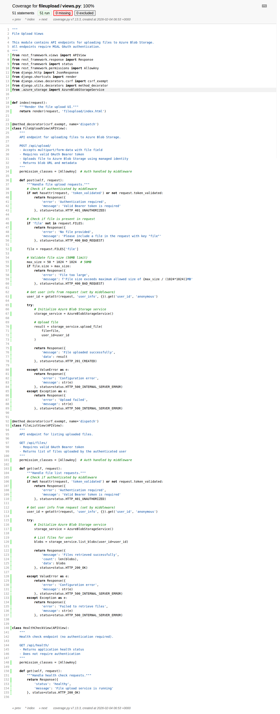

# Screenshots

This directory contains screenshots of the code coverage and test case results for the Django File Upload Application.

## Files

### 1. test_results_summary.png


A comprehensive visual summary of all test results including:
- Total number of tests run: **30 tests**
- Tests passed: **30 tests (100% success rate)**
- Tests failed: **0 tests**
- Test categories breakdown:
  - Azure Blob Storage Service Tests (7/7 passed)
  - File Upload View Tests (5/5 passed)
  - File List View Tests (3/3 passed)
  - Health Check View Tests (1/1 passed)
  - Index View Tests (1/1 passed)
  - MSAL Auth Middleware Tests (7/7 passed)
  - Additional Coverage Tests (6/6 passed)

### 2. code_coverage_report.png


Overall code coverage report showing:
- **Total coverage: 86%**
- Coverage breakdown by file
- Statement counts and coverage percentages
- Shows 100% coverage for all core application files (fileupload module)

### 3. code_coverage_detail_views.png


Detailed line-by-line coverage report for `fileupload/views.py`:
- **100% coverage** on the views module
- All 51 statements covered by tests
- Shows which lines were executed during testing
- Demonstrates comprehensive test coverage of API endpoints

## How to Generate These Screenshots

To regenerate these screenshots:

1. Run the tests with coverage:
   ```bash
   pip install coverage
   coverage run --source='.' manage.py test
   coverage report
   coverage html
   ```

2. The HTML coverage report will be in the `htmlcov/` directory

3. Open `htmlcov/index.html` in a browser to view the coverage report

4. Take screenshots of:
   - The main coverage page
   - Individual file detail pages
   - Test results output

## Test Execution Date

These screenshots were generated on: **February 4, 2026**

## Test Framework

- **Testing Framework**: Django's built-in test framework
- **Coverage Tool**: Coverage.py v7.13.3
- **Total Tests**: 30 unit tests
- **Success Rate**: 100%
